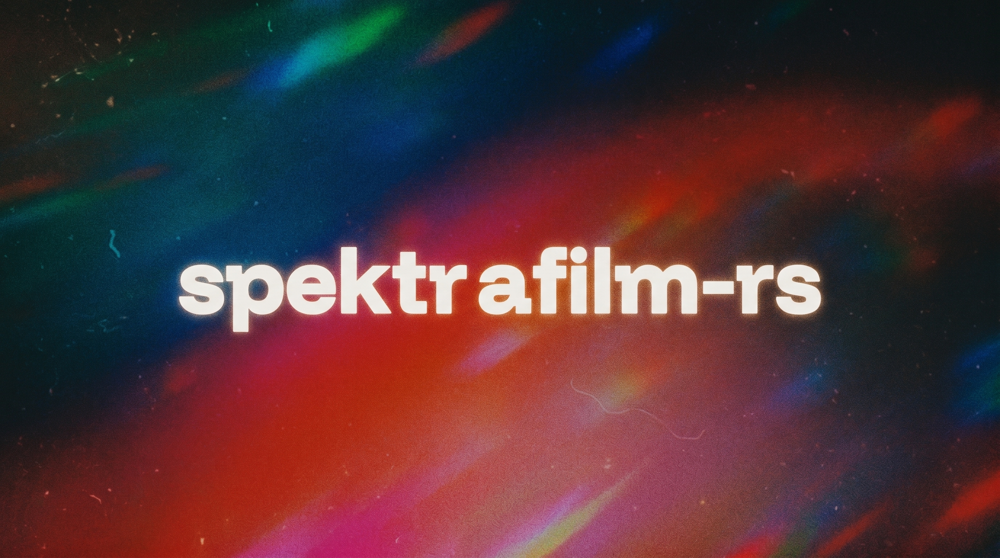

# spektrafilm-rs



A Rust port of [andreavolpato/spektrafilm](https://github.com/andreavolpato/spektrafilm) — a spectral simulator for analogue colour film and the print-and-scan chain.

The same spectral integration the original Python project does (RGB → film dye density → enlarger illuminant → print paper → scanner RGB), reimplemented in Rust with a GPU preview and a parity-faithful CPU export. The point of the port is **bit-identical output to the Python reference** at f64 precision while running in a fraction of the wall time.

---

## What it does

- **Spectral pipeline.** Hanatos2025 RGB→raw spectral upsampling, full 81-wavelength film/print/scanner spectral integration, density-curve interpolation, halation, DIR couplers, grain (bit-exact numpy `MT19937` port), glare, output CCTF encoding.
- **Live interactive preview** on the GPU (wgpu / Metal on macOS) — slider drags update at 60 fps on a 6 MP working image.
- **Reference-quality export** on the CPU at f64 — verified bit-identical to the Python reference for the bare chain (max diff 1/255 from 8-bit quantisation, mean 0.00004).
- **Decoupled preview + export.** GUI uses f32 GPU for iteration, then shells out to the f64 CPU binary for the final write. The export runs in a worker thread with a cancel button and proper child-process lifecycle.
- **Profiles bundled.** 30+ film and paper profiles in `data/profiles/` — Kodak Gold/Portra/Ektar, Fuji Velvia/Provia, Kodak Endura papers, Fuji Crystal Archive papers.

## Build

Requires Rust stable (≥ 1.80) and the standard system toolchain.

```bash
git clone <this-repo> && cd spektrafilm-rs

# GUI (wgpu/Metal preview, eframe)
cargo build --release -p spektrafilm-gui

# f32 CLI — fast batch processor, defaults to GPU backend
cargo build --release -p spektrafilm-cli

# f64 CLI — reference precision (CPU only; WGSL has no f64)
cargo build --release --features precision-f64 -p spektrafilm-cli
cp target/release/spektrafilm target/release/spektrafilm-f64

# Helper used by the GUI's Export button — bit-identical RAW decode
cargo build --release -p spektrafilm-cli --bin decode_raw_gui
```

The GUI auto-detects the f64 binary via `$SPEKTRAFILM_F64_CLI`, then `spektrafilm-f64` on `PATH`, then next to its own executable, then `target/release/spektrafilm-f64`.

Currently only on MacOS, windows compability was tested at early stages, so something might not work.

## Usage

### GUI

```bash
./target/release/spektrafilm-gui [optional/path/to/image.orf]
```

- **Open…** — load a TIFF, PNG, or camera RAW (DNG/CR2/CR3/NEF/ARW/ORF/RW2/etc., decoded via [`rawler`](https://github.com/dnglab/dnglab)).
- **Sliders** — exposure, film format, halation, DIR couplers, grain, glare, scanner, enlarger, output. All live-updating against the GPU preview.
- **Profiles** — film stock and print paper combo boxes; picking a film auto-selects its paired paper (`target_print` in the profile).
- **Zoom** — scroll wheel or trackpad pinch over the preview (cursor-anchored), click-drag to pan, double-click to reset.
- **Export…** — re-runs the pipeline at f64 precision on the CPU and writes a PNG/TIFF/JPEG. Status bar shows elapsed time; **Cancel** kills the child cleanly. Closing the GUI mid-export also kills the child (no orphans).
- **Save…** — write the f32 GPU preview directly (instant, less precise).

### CLI

```bash
# f32 GPU (fast)
./target/release/spektrafilm process input.ORF -o out.png \
    --film kodak_gold_200 --paper kodak_portra_endura --data-dir data

# f64 CPU (reference)
SPEKTRAFILM_BACKEND=cpu VECLIB_MAXIMUM_THREADS=1 \
    ./target/release/spektrafilm-f64 process input.ORF -o out.png \
    --film kodak_gold_200 --paper kodak_portra_endura --data-dir data

# Override any params via JSON (matches RuntimeParams struct)
... --params my_params.json

# List available film + paper profiles
./target/release/spektrafilm list-profiles --data-dir data
```

The `VECLIB_MAXIMUM_THREADS=1` on macOS pins Accelerate BLAS to single-thread so the per-stage rayon chunking (see *Performance* below) doesn't fight Accelerate's own thread pool.

## Parity

Verified against the upstream Python `spektrafilm` v0.3.2 reference on the bare-chain (no stochastic FX):

| Stage | Max diff | Mean diff | Identical pixels |
|---|---|---|---|
| `log_raw` (post-Hanatos + log10) | **8.9 × 10⁻¹⁵** (one f64 ULP) | 3.4 × 10⁻¹⁶ | — |
| Film density CMY | **1.1 × 10⁻¹⁵** | 1.7 × 10⁻¹⁶ | — |
| Print density CMY | **3.1 × 10⁻¹⁵** | 3.0 × 10⁻¹⁶ | — |
| Final PNG (8-bit) | **1 / 255** | 0.00004 / 255 | **99.9962 %** |

With grain on, the binomial sampler's rejection step is sensitive to upstream ULP shifts and the rendered grain texture diverges per pixel — this is by design (matches numpy's behaviour) and produces the same average tone with a different grain pattern.

The LUT path (`use_enlarger_lut` + `use_scanner_lut`, the typical export config) uses a bit-exact port of Python's PCHIP 3D interpolation (`crates/spektrafilm-math/src/pchip3d.rs` ↔ `spektrafilm/utils/fast_interp_lut.py`). Parity numbers above hold for both the LUT and non-LUT paths.

## Performance

f64 CPU export on a 16 MP Olympus ORF (kodak_gold_200 → kodak_portra_endura, full FX):

| | Wall time | Notes |
|---|---|---|
| Python reference (numpy + numba) | 22 s | LUT enabled, default config |
| **spektrafilm-rs (f64 CPU)** | **14 s** | **35 % faster than Python** |

What gets it there:

- **PCHIP LUTs** for the spectral integrations (enlarger + scanner) — same approximation Python uses, same accuracy budget.
- **`vForce vvpow`** for `10^x` on the spectral chain — Accelerate's SIMD pow, bit-identical to libm `pow(10, x)`.
- **Row-chunked dgemm across rayon** — Accelerate BLAS doesn't thread K=3 contractions, so we split the M dimension ourselves.
- **`VECLIB_MAXIMUM_THREADS=1`** on the export child so Accelerate's internal pool doesn't contend with rayon.
- **Parallelised hot per-pixel loops** in the printing and scanning post-stages.

GPU preview path uses wgpu compute shaders (`crates/spektrafilm-shaders/wgsl/`). All shaders are f32 (WGSL has no f64); the GPU path drives the live preview while the export reaches for f64 CPU. End-to-end preview render: ~250 ms at 6 MP, ~700 ms at 16 MP on Apple Silicon.

## Layout

```
crates/
  spektrafilm-math/    f64 reference math (spectral, interp, PCHIP, RNG, vForce bindings)
  spektrafilm-model/   stochastic + physical models (grain, halation, DIR couplers, glare)
  spektrafilm-core/    pipeline orchestration, profiles, stage definitions
  spektrafilm-gpu/     ComputeBackend trait + CPU (rayon + BLAS) and wgpu backends
  spektrafilm-shaders/ WGSL / Metal / CUDA compute shaders
  spektrafilm-cli/     `spektrafilm` (process, list-profiles, gen-lut) + `decode_raw_gui`
  spektrafilm-gui/     egui/eframe preview (wgpu renderer, Metal-backed on macOS)
data/
  profiles/            film + paper JSON profiles (spectral sensitivities, density curves, etc.)
  luts/                Hanatos2025 spectral basis + standard observer CMFs (.npy)
  filters/             neutral-print enlarger filter database
scripts/parity/        Python ↔ Rust comparison harness (spektra_compare.py, etc.)
tests/                 reference outputs + integration test fixtures
```

## Credits

Original Python implementation by Andrea Volpato — [andreavolpato/spektrafilm](https://github.com/andreavolpato/spektrafilm). All spectral data, film/paper profiles, and pipeline architecture come from there. This port owes its existence to Andrea and its work.

The spectral-upsampling LUT (`hanatos2025_*`) is named after [Johannes Hanatos](https://github.com/hanatos), author of [vkdt](https://github.com/hanatos/vkdt), who provided the upstream Python project with the LUT files and sample code that drive the RGB → spectrum step.

PCHIP 3D LUT, MT19937 binomial sampler, and CIE 1931 observer constants are ported from numpy / scipy / scikit-image / colour-science.

Claude code for being this awesome.

## License

GPL-3.0, matching the upstream Python project. See [LICENSE](LICENSE) for the full text.
